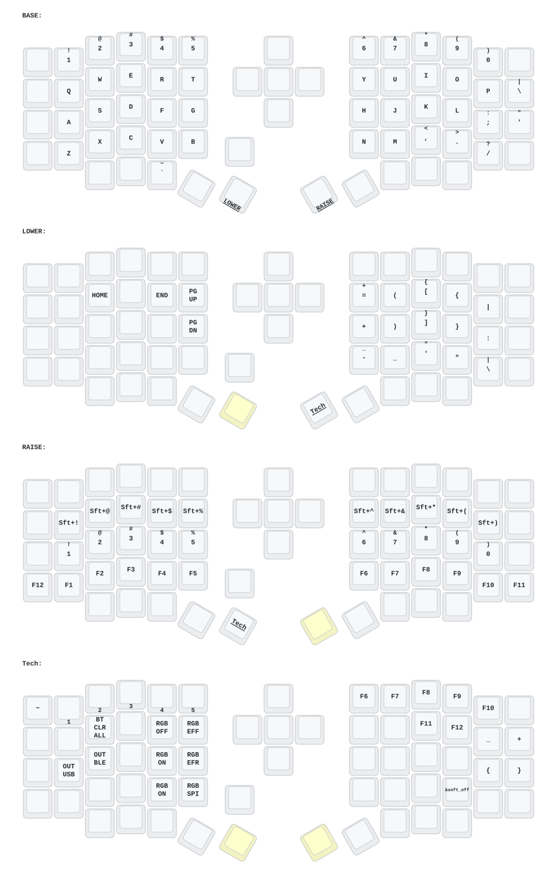

# Sofle

- [English](README.md)
- [中文](README_ZH.md)

ZMK firmware configuration for the Eyelash Sofle split keyboard.

## About this fork

This fork tracks the vendor configuration ([a741725193/zmk-sofle](https://github.com/a741725193/zmk-sofle))
but builds against **upstream [ZMK](https://github.com/zmkfirmware/zmk)** rather
than a third-party ZMK fork.

Practically, that means:

- The `zmk` revision in `config/west.yml` is a pinned commit of
  `zmkfirmware/zmk` `main`. Bump it deliberately, and keep the workflow ref in
  `.github/workflows/build.yml` on a matching Zephyr generation.
- **ZMK Studio is supported.** **DYA Studio is not** — it depends on a custom
  Studio RPC protocol that only exists in the vendor's ZMK fork.
- The keyboard is built as a *shield* (`boards/shields/eyelash_sofle`) on the
  `nice_nano//zmk` board, following upstream's Hardware Model v2 naming.

## Update list

- **2026/6/22** — The vendor firmware added key remapping via DYA STUDIO. *Not
  available in this fork*; use ZMK Studio instead.
- **2025/8/22**
  1. Soft-off updated. Press and hold Q, S and Z together for 2 seconds and the
     keyboard enters deep sleep; it cannot be woken with a keypress. Useful when
     carrying it around. Wake it by pressing the reset switch once.
  2. The low-profile Sofle and Corne cases were updated. The frame and base
     plate are thicker, and the reset switch opening was adjusted so the switch
     is easy to press. A case with a tilt stand is still being designed. If you
     look closely at the PCB you will notice headers reserved for expansion IO.
  3. The GIF animation on the right-hand display was removed, which
     significantly reduces power draw on the right half.
- **2025/3/30** — Sleep timeout raised to 1 hour, debounce time increased, and
  power consumption after sleep improved.
- **2024/12/21** — Added ZMK Studio support (only the left half needs
  reflashing).
- **2024/10/24**
  1. Changed the power supply mode to reduce power consumption.
  2. Fixed automatic shut-off of the RGB power supply.

> If your Sofle was last updated before 2025/8/22, please flash the latest
> firmware.

## Building

Firmware is built by GitHub Actions on every push. Download the artifacts from
the **Build ZMK firmware** workflow run and flash the `.uf2` files:

| Artifact | Flash to |
| --- | --- |
| `eyelash_sofle_left` | left half (this is the ZMK Studio build) |
| `eyelash_sofle_right` | right half |
| `settings_reset` | either half, to clear stored settings and BLE bonds |

## Contact

For 3D-printed model files (see also `sofle-3D-MODEL.zip` in this repo), or if
the keyboard misbehaves, contact the vendor at
[380465425@qq.com](mailto:380465425@qq.com).

## Sofle keymap

